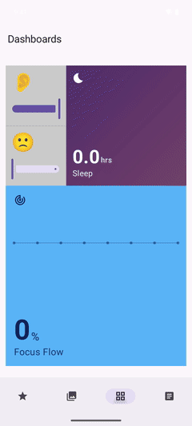

# Golden Grids — Android (Jetpack Compose)

A native Android port of `@gifcommit/golden-grids`, rendered with Jetpack Compose
over the **same** framework-agnostic render model as the web, React Native and
SwiftUI versions. The Kotlin core is verified against the shared
[`render-model.json`](../src/__fixtures__/render-model.json) golden master, so the
spiral proportions, HSL colour progression and slot↔child ordering are identical
across every platform.

## Modules

| Module      | Type                  | What it is                                                                 |
| ----------- | --------------------- | -------------------------------------------------------------------------- |
| `:core`     | Kotlin/JVM library    | Pure `computeRenderModel` (spiral layout, fibonacci range, hex→HSL). No Android dependency. |
| `:renderer` | Android library       | The `GoldenGrid` composable — a thin renderer over the core model.         |
| `:example`  | Android app           | A runnable showcase: a colour-progression grid and content-mapped slots.   |

## The composable

```kotlin
import com.gifcommit.goldengrids.GoldenGrid

// Proportional colour boxes:
GoldenGrid(from = 1, to = 5, color = "#7f7ec7", modifier = Modifier.fillMaxWidth())

// Map your own content into the slots — ordinal 0 = the largest slot:
GoldenGrid(from = 1, to = 4, modifier = Modifier.fillMaxWidth()) { ordinal ->
    Box(Modifier.fillMaxSize(), contentAlignment = Alignment.Center) {
        Text("${ordinal + 1}")
    }
}
```

`GoldenGrid(from, to, color, clockwise, placement, modifier, placeholderContent, slotContent)`
mirrors the props of every other platform. When `from > 1`, the skipped-range
placeholder is filled by `placeholderContent`.

## Prerequisites

- **JDK 17 or 21** (an LTS — AGP/Compose do not support JDK 26 yet)
- **Android SDK** with platform 35 and build-tools 35 (set `sdk.dir` in
  `local.properties`, or `ANDROID_HOME`)

The pure `:core` module needs only a JDK — no Android SDK. `:renderer` and
`:example` are added to the build automatically when an SDK is configured
(`ANDROID_HOME` or `local.properties` `sdk.dir`), so `./gradlew :core:test` runs
on a JDK-only machine without evaluating the Android build scripts.

## Build & test

```bash
# Verify the Kotlin core against the cross-language golden master (no SDK needed):
./gradlew :core:test

# Build the example app:
./gradlew :example:assembleDebug
# -> example/build/outputs/apk/debug/example-debug.apk

# Install & launch on a running emulator/device:
adb install -r example/build/outputs/apk/debug/example-debug.apk
adb shell am start -n com.gifcommit.goldengrids.example/.MainActivity
```

Built and verified with Gradle 8.11.1, AGP 8.7.3, Kotlin 2.1.0, Compose BOM 2024.12.01.

## Example screens

`:example` mirrors `Examples/iOS` — four screens, icons-only bottom navigation, each
built entirely with `GoldenGrid`: a swipeable **Featured** carousel, a sky **Gallery**,
a stats **Dashboard** (count-up figures, a settling plot, a dusk→night gradient, gliding
selectors), and a text-first **Editorial** article. Each screen builds itself in on appear.

<p align="center">
  
  
  
  
</p>
