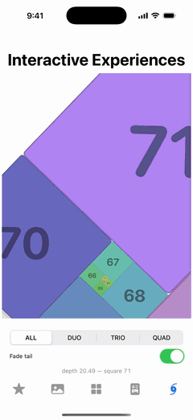

# Spiral dial

[← back to the README](../README.md)

`spiralCamera` turns a layout into a dialable view: give it a depth and it
returns the transform that fills the viewport with one square — the focus —
composed exactly as the spiral places its neighbours. Depth 0 focuses the last
(largest) square; each whole step moves one square deeper, toward the eye.
Scale interpolates geometrically and rotation advances 90° per step, so a
scroll-bound depth feels like one continuous dial. Framework-free: bind it to
scroll, a slider, or a clock — the camera only answers "where is the viewport
at depth d".

```ts
import {
  generateGoldenGridLayout,
  spiralCamera,
  spiralEye,
  spiralWindow,
  tileOnScreen,
  toCssContentTransform,
  toCssTileTransform,
  windowFadeDepth,
} from '@gifcommit/golden-grids';

const layout = generateGoldenGridLayout([1, 1, 2, 3, 5, 8, 13], true, 0);
const frame = spiralCamera(layout, depth, innerWidth, innerHeight);

// RENDER PER TILE — not one camera transform on a shared stage. A stage
// transform rasterizes the 1-unit deep squares and upscales the raster
// hundreds of times, so the deep dial goes to mush. toCssTileTransform
// composes camera ∘ placement flat per tile: render each square into a
// fixed texture box (512px by default) and its net raster scale stays near
// 1 at focus. The tiles sit at the stage origin, untransformed stage.
for (const [k, square] of layout.squares.entries()) {
  const tile = tiles[k];
  tile.style.width = tile.style.height = '512px';
  tile.style.transformOrigin = '0 0'; // the decomposition assumes it
  tile.style.transform = toCssTileTransform(frame, square, innerWidth, innerHeight);

  // How present is square k at this depth? One ramp gives you "a few tiles
  // at a time" and the crossfade; hidden fires exactly when opacity reaches
  // zero, so invisible content never stays focusable. Deliberately
  // asymmetric: only OUTWARD squares (larger than the focus, behind the
  // camera) fade — the interior never does, so squares emerge from the
  // centre small but fully present instead of materializing through a
  // fade-in.
  //
  // The fade itself is the only thing to configure. { fade: false } leaves
  // the tail SOLID — it does not remove it: every square keeps full presence
  // at any distance, so the outward ones go on filling the negative space
  // around the focus and bleeding off the page, exactly as the geometry
  // places them. Culling one that has left the viewport is tileOnScreen's
  // job, below — a step count cannot answer it.
  //
  // The ramp itself is fixed: one straight line, full presence to one step
  // out and zero at three. It used to take both distances and an easing
  // exponent; the extra control bought nothing a reader could name, and
  // every one of them was a way to describe a window that looks wrong.
  const { opacity, hidden } = spiralWindow(k, depth, layout.squares.length);
  // Is this square still using on-screen space? The spiral TILES the plane —
  // squares sit beside one another, not inside — so most of the layout is off
  // the page at any one depth, and how far a square travels before it clears
  // the viewport depends on fillRatio, the anchor and the aspect. Geometry
  // answers that; a distance in depth steps cannot. Needed for a solid tail,
  // and an improvement for a fading one (a faded tile can still be the thing
  // filling the space beside the focus).
  const onScreen = tileOnScreen(frame, square, innerWidth, innerHeight);
  tile.style.opacity = String(opacity);
  tile.style.visibility = hidden || !onScreen ? 'hidden' : 'visible';

  // Keep the CONTENT readable while the dial turns: counter-rotate the
  // tile's content element against the stage about its own centre
  // (transform-origin 50% 50% — not the tile's 0 0), so it orbits with its
  // tile but never spins. The |cosθ|+|sinθ| cover swell keeps the clip box
  // full mid-turn (exactly 1 at rest, √2 at worst). A configuration detail:
  // { counterRotate: false } is the identity for consumers who want content
  // to ride the spiral; { cover: false } for content that must never scale.
  const art = tile.firstElementChild as HTMLElement;
  art.style.transformOrigin = '50% 50%';
  art.style.transform = toCssContentTransform(frame);
}
// (React Native: toNativeTileTransform / toNativeContentTransform;
//  Swift: toAffineTileTransform + contentTransform;
//  Kotlin: tileTransform + contentTransform, graphicsLayer pivots.)

// Optional anchor: where the focused square's centre lands, defaulting to
// the viewport centre. Pass a point to pin the dial against an edge — half
// the RENDERED focus size (fillRatio × min side, from the same fillRatio you
// gave spiralCamera) pins its edge flush AT WHOLE DEPTHS, where a dial
// rests. Mid-turn the rotated square's half-extent grows by
// |cosθ| + |sinθ| (up to √2 at 45°), so its corner sweeps past the edge —
// usually the desired bleed. Which edge to hug, and when, is your layout's
// decision:
const fillRatio = 0.62; // must match the spiralCamera call
const focusHalf = (fillRatio * Math.min(innerWidth, innerHeight)) / 2;
const flushLeft = { x: focusHalf, y: innerHeight / 2 };
toCssTileTransform(frame, layout.squares[0], innerWidth, innerHeight, {
  anchor: flushLeft, // pass the same anchor for every tile in the loop above
});

// The spiral's convergence point, e.g. as a transform origin or annotation
// anchor (centre of the smallest square; exact in the φ-limit).
const eye = spiralEye(layout);

// The depth at which a square lands on the window's outward boundary — the
// inverse of spiralWindow, and the depth to freeze a departing tile at if
// you keep its layer alive rather than dropping it. (Blink discards a
// dropped layer's decoded artwork, so reversing the dial repaints white for
// hundreds of milliseconds unless the tile stays parked with its transform
// pinned here.) It follows the ROUNDED opacity you actually render rather
// than the ramp's theoretical end, so pass the same { fade } you gave
// spiralWindow and the two stay inverses of each other.
const boundary = windowFadeDepth(0, layout.squares.length);
```

(`toCssTransform` — one matrix for a whole stage — still exists for cases
where every square is a similar size on screen; for a deep dial, use the
per-tile form above.)

<p align="center">
  
</p>

## Which way the dial trails

At depth 0 the whole spiral — everything the reader is about to dial through —
sits to ONE side of the focused square, and which side cycles with the square
count as well as `rotate`: fifteen squares at `rotate: 180` trail downward,
five squares at the same rotation trail *upward*, off the top. Anything that
filters its content is picking a direction by accident unless it solves for
one. `trailToRotateDeg` is that solve, and `trailForRotation` reads it back.

```ts
import { trailToRotateDeg, trailForRotation } from '@gifcommit/golden-grids';

// Grow into the open space: to the right of a side column, below a stacked
// header. Which side is open is your layout's decision, like the anchor.
const trail = innerWidth >= innerHeight ? 'right' : 'bottom';
// Solve for the count you are about to LAY OUT — the same sequence, not the
// unfiltered one. A mismatch here targets the wrong side, and filtering is
// exactly when it happens.
const fib = fibonacciFor(items.length);
const rotate = trailToRotateDeg(trail, /* clockwise */ true, fib.length);
const layout = generateGoldenGridLayout(fib, true, rotate);

trailForRotation(180, true, 15); // 'bottom'
trailForRotation(180, true, 5);  // 'top' — same rotation, different count
```

## Per-platform equivalents

The camera is the same math on every platform, ported function-for-function
against a shared golden-master fixture (`src/__fixtures__/spiral-camera.json`,
asserted within 1e-9):

- **Web / React Native** — everything above; `/native` swaps `toCssTileTransform`
  → `toNativeTileTransform` and `toCssContentTransform` → `toNativeContentTransform`.
- **iOS (SwiftUI)** — `SpiralCamera.swift`: `spiralCamera`, `spiralWindow`,
  `spiralEye`, the trail solves, `toAffineTileTransform`, `contentTransform`.
  See the **Spiral** screen in [`Examples/iOS`](../Examples/iOS/README.md).
- **Android (Compose)** — `SpiralCamera.kt`: the same functions, plus
  `tileTransform` for a top-left-pivot `graphicsLayer`. See **Interactive
  Experiences** in [`android/example`](../android/README.md).
